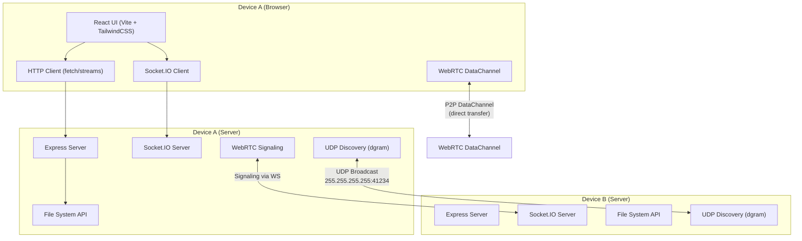

# LocalDrop — High-Performance Local File Sharing App
npx eas build -p android --profile preview


A production-grade, AirDrop-like local file sharing web app that works entirely on local networks without internet.

---

## Step 1: Architecture Diagram



### How It Works
1. **Each device runs both a server AND opens the web UI** in a browser
2. **Discovery**: Servers find each other via UDP broadcast on port 41234
3. **Signaling**: Socket.IO relays WebRTC SDP offers/answers between peers
4. **File Transfer (2 modes)**:
   - **HTTP Streaming** (default): Chunked upload/download via Express REST API — reliable, handles 1GB+ files
   - **WebRTC P2P** (optional upgrade): Direct browser-to-browser via DataChannel — lowest latency, no server bottleneck

---

## Step 2: Folder Structure

```
FTP/
├── apps/
│   ├── web/                          # React frontend (Vite)
│   │   ├── src/
│   │   │   ├── components/
│   │   │   │   ├── DeviceList.tsx         # Connected devices grid
│   │   │   │   ├── DeviceCard.tsx         # Single device card
│   │   │   │   ├── FileExplorer.tsx       # File browser panel
│   │   │   │   ├── FileItem.tsx           # Single file/folder row
│   │   │   │   ├── TransferPanel.tsx      # Active transfers list
│   │   │   │   ├── TransferItem.tsx       # Single transfer progress
│   │   │   │   ├── DropZone.tsx           # Drag & drop upload area
│   │   │   │   ├── QRCodePairing.tsx      # QR code pairing modal
│   │   │   │   └── FilePreview.tsx        # Image/video preview modal
│   │   │   ├── hooks/
│   │   │   │   ├── useSocket.ts           # Socket.IO connection hook
│   │   │   │   ├── useDevices.ts          # Device discovery state
│   │   │   │   ├── useFileTransfer.ts     # Upload/download logic
│   │   │   │   ├── useWebRTC.ts           # WebRTC DataChannel hook
│   │   │   │   └── useFileExplorer.ts     # Remote file browsing
│   │   │   ├── lib/
│   │   │   │   ├── socket.ts              # Socket.IO singleton
│   │   │   │   ├── webrtc.ts              # WebRTC connection manager
│   │   │   │   ├── chunkedUpload.ts       # Chunked file upload logic
│   │   │   │   └── streamDownload.ts      # Streamed file download
│   │   │   ├── types/
│   │   │   │   └── index.ts               # Shared frontend types
│   │   │   ├── App.tsx
│   │   │   ├── main.tsx
│   │   │   └── index.css                  # Tailwind directives + custom styles
│   │   ├── index.html
│   │   ├── vite.config.ts
│   │   ├── tailwind.config.ts
│   │   ├── tsconfig.json
│   │   └── package.json
│   │
│   └── server/                       # Node.js backend
│       ├── src/
│       │   ├── index.ts                   # Entry: Express + Socket.IO + Discovery
│       │   ├── routes/
│       │   │   ├── files.ts               # File system REST API
│       │   │   ├── transfer.ts            # Upload/download streaming endpoints
│       │   │   └── devices.ts             # Device info endpoints
│       │   ├── services/
│       │   │   ├── discovery.ts           # UDP broadcast discovery
│       │   │   ├── fileSystem.ts          # Safe file system operations
│       │   │   ├── transferManager.ts     # Track active transfers
│       │   │   └── sessionManager.ts      # Session-based auth
│       │   ├── websocket/
│       │   │   ├── handler.ts             # Socket.IO event handlers
│       │   │   └── events.ts              # Event name constants
│       │   ├── webrtc/
│       │   │   └── signaling.ts           # WebRTC signaling relay
│       │   ├── middleware/
│       │   │   ├── auth.ts                # Session token validation
│       │   │   └── cors.ts                # CORS for local network
│       │   ├── utils/
│       │   │   ├── network.ts             # Get local IP, interfaces
│       │   │   └── crypto.ts              # Session tokens, optional E2E
│       │   └── types/
│       │       └── index.ts               # Shared backend types
│       ├── tsconfig.json
│       └── package.json
│
├── packages/
│   ├── shared-types/                 # Shared TypeScript types
│   │   ├── src/
│   │   │   ├── device.ts
│   │   │   ├── file.ts
│   │   │   ├── transfer.ts
│   │   │   └── index.ts
│   │   ├── tsconfig.json
│   │   └── package.json
│   │
│   └── ui/                           # Shared UI components
│       ├── src/
│       │   ├── Button.tsx
│       │   ├── ProgressBar.tsx
│       │   ├── Modal.tsx
│       │   ├── Badge.tsx
│       │   └── index.ts
│       ├── tsconfig.json
│       └── package.json
│
├── turbo.json
├── package.json
├── pnpm-workspace.yaml
├── tsconfig.base.json
└── README.md
```

---

## Step 3: Backend Implementation

### 3.1 REST API Design

| Method | Endpoint | Description |
|--------|----------|-------------|
| `GET` | `/api/device/info` | Return this device's name, ID, IP, platform |
| `GET` | `/api/devices` | List all discovered devices |
| `POST` | `/api/pair` | Pair via session code / QR token |
| `GET` | `/api/files?path=<dir>` | List files/folders at path |
| `GET` | `/api/files/download?path=<file>` | Stream download a file |
| `POST` | `/api/files/upload` | Chunked upload (multipart stream) |
| `POST` | `/api/files/upload/chunk` | Resume-capable chunked upload |
| `GET` | `/api/files/preview?path=<file>` | Get image/video thumbnail |
| `GET` | `/api/transfer/status` | Get all active transfer statuses |

### 3.2 Key Backend Services

**Device Discovery** (`services/discovery.ts`):
- Uses Node.js `dgram` module for UDP broadcast on port 41234
- Broadcasts a JSON heartbeat every 3 seconds: `{ id, name, ip, port, platform }`
- Listens for other devices' broadcasts and maintains a device registry
- Devices that miss 3 heartbeats are marked offline
- Filters out virtual/VPN interfaces using `os.networkInterfaces()`

**File System Service** (`services/fileSystem.ts`):
- Path sandboxing: all paths validated against a configurable root directory
- Uses `fs.createReadStream()` / `fs.createWriteStream()` — never loads files into memory
- Returns file metadata: name, size, type, modified date, isDirectory

**Transfer Manager** (`services/transferManager.ts`):
- Tracks all active uploads/downloads with unique transfer IDs
- Reports progress via Socket.IO events
- Supports concurrent transfers with a configurable limit
- Handles chunked uploads: tracks received chunks, reassembles on completion

### 3.3 File Streaming Approach

```
Upload:  Client → multipart stream → Busboy parser → fs.createWriteStream(path)
Download: fs.createReadStream(path) → HTTP response stream (Content-Disposition)
```

- **Chunked uploads**: Files split into 1MB chunks client-side, each sent as a separate request with chunk index + total count
- **Resume support**: Server tracks received chunks per transfer ID; client queries missing chunks on reconnect
- **Backpressure**: Node.js streams handle backpressure natively — no memory bloat

---

## Step 4: Frontend Implementation

### 4.1 Core Pages/Views

**Main Layout**: Single-page app with 3 panels:
1. **Left sidebar** — Device list + QR pairing button
2. **Center** — File explorer (remote device files)
3. **Bottom drawer** — Active transfers with progress bars

### 4.2 Key Components

- **DeviceList**: Polls discovered devices via Socket.IO, shows online/offline status with animated indicators
- **FileExplorer**: Fetches remote file listing via REST, supports breadcrumb navigation, click-to-download, drag-and-drop upload
- **TransferPanel**: Subscribes to `transfer:progress` Socket.IO events, shows real-time progress bars with speed and ETA
- **DropZone**: Uses HTML5 Drag & Drop API, supports folder drops, initiates chunked upload on drop

### 4.3 State Management

- React Context + `useReducer` for global device/transfer state
- No Redux needed — the app state is simple enough for Context
- Socket.IO events dispatch to reducer for real-time updates

---

## Step 5: Real-Time Communication (WebSocket Events)

### Socket.IO Event Design

| Event | Direction | Payload | Description |
|-------|-----------|---------|-------------|
| `device:discovered` | Server→Client | `Device` | New device found on network |
| `device:lost` | Server→Client | `{ deviceId }` | Device went offline |
| `device:list` | Server→Client | `Device[]` | Full device list refresh |
| `transfer:request` | Client→Server | `{ targetDeviceId, files[] }` | Request to send files |
| `transfer:approve` | Client→Server | `{ transferId, approved }` | Approve/reject incoming transfer |
| `transfer:start` | Server→Client | `{ transferId, fileName, size }` | Transfer beginning |
| `transfer:progress` | Server→Client | `{ transferId, bytesTransferred, totalBytes, speed }` | Progress update |
| `transfer:complete` | Server→Client | `{ transferId }` | Transfer finished |
| `transfer:error` | Server→Client | `{ transferId, error }` | Transfer failed |
| `rtc:offer` | Client→Server | `{ targetId, sdp }` | WebRTC SDP offer relay |
| `rtc:answer` | Client→Server | `{ targetId, sdp }` | WebRTC SDP answer relay |
| `rtc:ice-candidate` | Client→Server | `{ targetId, candidate }` | ICE candidate relay |
| `pair:request` | Client→Server | `{ code }` | Pair via device code |
| `pair:qr` | Server→Client | `{ qrData }` | QR code data for pairing |

---

## Step 6: File Transfer Logic

### 6.1 HTTP Streaming (Primary — reliable, 1GB+ support)

**Upload Flow**:
1. Client splits file into 1MB chunks using `File.slice()`
2. Each chunk sent as `POST /api/files/upload/chunk` with headers: `X-Transfer-Id`, `X-Chunk-Index`, `X-Total-Chunks`, `X-File-Name`
3. Server writes each chunk to a temp file, tracks progress
4. On final chunk: reassemble temp files → final file, emit `transfer:complete`
5. Progress reported via Socket.IO every 100ms (throttled)

**Download Flow**:
1. Client calls `GET /api/files/download?path=<file>` on target device's server
2. Server streams file via `fs.createReadStream()` with `Content-Length` header
3. Client uses `ReadableStream` + `Response.body` to track download progress
4. File saved via browser download or `showSaveFilePicker()` API

### 6.2 WebRTC P2P (Optional Upgrade — lowest latency)

**Connection Flow**:
1. Device A creates `RTCPeerConnection` (no STUN/TURN needed on LAN)
2. Device A creates DataChannel, generates SDP offer → sends via Socket.IO signaling
3. Device B receives offer, creates answer → sends back via Socket.IO
4. ICE candidates exchanged (local candidates only — LAN)
5. DataChannel opens → direct P2P connection established

**Transfer via DataChannel**:
- Files chunked to 64KB (DataChannel limit)
- Binary transfer using `ArrayBuffer`
- Flow control: sender waits for `bufferedAmount` to drop before sending next chunk
- Metadata (filename, size, type) sent as first JSON message before binary data

---

## Step 7: Optimization Techniques

| Area | Technique |
|------|-----------|
| **Memory** | Never load full files — use `fs.createReadStream/WriteStream` and `File.slice()` |
| **Speed** | HTTP streaming for reliability; WebRTC DataChannel for zero-hop P2P |
| **Concurrency** | Multiple transfers run in parallel with individual progress tracking |
| **UI Performance** | Throttle progress updates to 10fps; use `React.memo` on file list items |
| **Network** | UDP broadcast for discovery (no polling); WebSocket for events (no HTTP polling) |
| **Chunks** | 1MB HTTP chunks (optimal for LAN); 64KB WebRTC chunks (DataChannel limit) |
| **Resume** | Server tracks chunk bitmap per transfer; client retries missing chunks |
| **Security** | Session tokens (crypto.randomUUID); path sandboxing; optional transfer approval |

---

## Step 8: Run Instructions

```bash
# 1. Clone / navigate to project
cd FTP

# 2. Install dependencies
pnpm install

# 3. Start all apps (dev mode)
pnpm dev

# This starts:
# - Frontend: http://localhost:5173 (Vite dev server)
# - Backend:  http://localhost:3001 (Express + Socket.IO)

# 4. Open browser on BOTH devices to http://<device-ip>:5173
# 5. Devices auto-discover each other on the same network
# 6. Start sharing files!
```

---

## Proposed Changes

### Turborepo Root Config
#### [NEW] [package.json](file:///d:/Desktop/MyProjects/FTP-Projects/FTP/package.json)
Root `package.json` with pnpm workspaces, turbo scripts (`dev`, `build`, `lint`).

#### [NEW] [turbo.json](file:///d:/Desktop/MyProjects/FTP-Projects/FTP/turbo.json)
Pipeline config: `build` depends on `^build`, `dev` is persistent.

#### [NEW] [pnpm-workspace.yaml](file:///d:/Desktop/MyProjects/FTP-Projects/FTP/pnpm-workspace.yaml)
Workspace definitions for `apps/*` and `packages/*`.

#### [NEW] [tsconfig.base.json](file:///d:/Desktop/MyProjects/FTP-Projects/FTP/tsconfig.base.json)
Base TypeScript config extended by all packages.

---

### Backend (`apps/server`)
#### [NEW] [src/index.ts](file:///d:/Desktop/MyProjects/FTP-Projects/FTP/apps/server/src/index.ts)
Entry point: Express server + Socket.IO + UDP discovery bootstrap.

#### [NEW] [src/routes/files.ts](file:///d:/Desktop/MyProjects/FTP-Projects/FTP/apps/server/src/routes/files.ts)
File listing, streaming download, chunked upload endpoints.

#### [NEW] [src/services/discovery.ts](file:///d:/Desktop/MyProjects/FTP-Projects/FTP/apps/server/src/services/discovery.ts)
UDP broadcast-based device discovery using `dgram`.

#### [NEW] [src/services/fileSystem.ts](file:///d:/Desktop/MyProjects/FTP-Projects/FTP/apps/server/src/services/fileSystem.ts)
Sandboxed file system operations with streaming I/O.

#### [NEW] [src/services/transferManager.ts](file:///d:/Desktop/MyProjects/FTP-Projects/FTP/apps/server/src/services/transferManager.ts)
Manages concurrent transfers, progress tracking, chunk reassembly.

#### [NEW] [src/websocket/handler.ts](file:///d:/Desktop/MyProjects/FTP-Projects/FTP/apps/server/src/websocket/handler.ts)
Socket.IO event handlers for device events, transfer events, and WebRTC signaling.

---

### Frontend (`apps/web`)
#### [NEW] [src/App.tsx](file:///d:/Desktop/MyProjects/FTP-Projects/FTP/apps/web/src/App.tsx)
Main app shell with device list, file explorer, and transfer panel.

#### [NEW] [src/components/](file:///d:/Desktop/MyProjects/FTP-Projects/FTP/apps/web/src/components/)
DeviceList, FileExplorer, TransferPanel, DropZone, QRCodePairing, FilePreview.

#### [NEW] [src/hooks/](file:///d:/Desktop/MyProjects/FTP-Projects/FTP/apps/web/src/hooks/)
useSocket, useDevices, useFileTransfer, useWebRTC, useFileExplorer.

#### [NEW] [src/lib/](file:///d:/Desktop/MyProjects/FTP-Projects/FTP/apps/web/src/lib/)
Socket.IO singleton, WebRTC manager, chunked upload, stream download utilities.

---

### Shared Packages
#### [NEW] [packages/shared-types/](file:///d:/Desktop/MyProjects/FTP-Projects/FTP/packages/shared-types/)
TypeScript interfaces for Device, FileEntry, Transfer, WebSocket events.

#### [NEW] [packages/ui/](file:///d:/Desktop/MyProjects/FTP-Projects/FTP/packages/ui/)
Reusable UI components: Button, ProgressBar, Modal, Badge.

---

## Verification Plan

### Automated Tests
- `pnpm build` — Ensure all packages compile without TypeScript errors
- `pnpm dev` — Verify dev servers start without errors
- Test UDP discovery by running server on two terminals with different ports

### Manual Verification
1. Open app on two devices on same WiFi
2. Verify devices auto-discover each other
3. Browse files on remote device
4. Upload a file (drag & drop) — verify progress bar and completion
5. Download a file — verify streaming and progress
6. Test with a 1GB+ file to confirm no memory issues
7. Test WebRTC P2P transfer between two browsers
8. Test QR code pairing fallback

---

## Open Questions

> [!IMPORTANT]
> **Shared Directory**: What root directory should the server expose for file browsing? Options:
> - User's home directory (`os.homedir()`)
> - A configurable path (e.g., `~/LocalDrop`)
> - A dedicated "shared" folder created by the app
>
> **Recommendation**: Default to `~/LocalDrop` with a configurable override.

> [!IMPORTANT]
> **TailwindCSS Version**: You mentioned Tailwind CSS. Should I use **Tailwind v4** (the latest, CSS-first config) or **Tailwind v3** (class-based config, more stable ecosystem)?
>
> **Recommendation**: Tailwind v4 for a greenfield project.

> [!NOTE]
> **Device Naming**: Should device names be auto-generated (e.g., hostname) or user-configurable on first launch?

> [!NOTE]
> **Transfer Approval**: Should incoming file transfers require explicit approval (more secure, like AirDrop) or auto-accept (faster, like a shared drive)?
